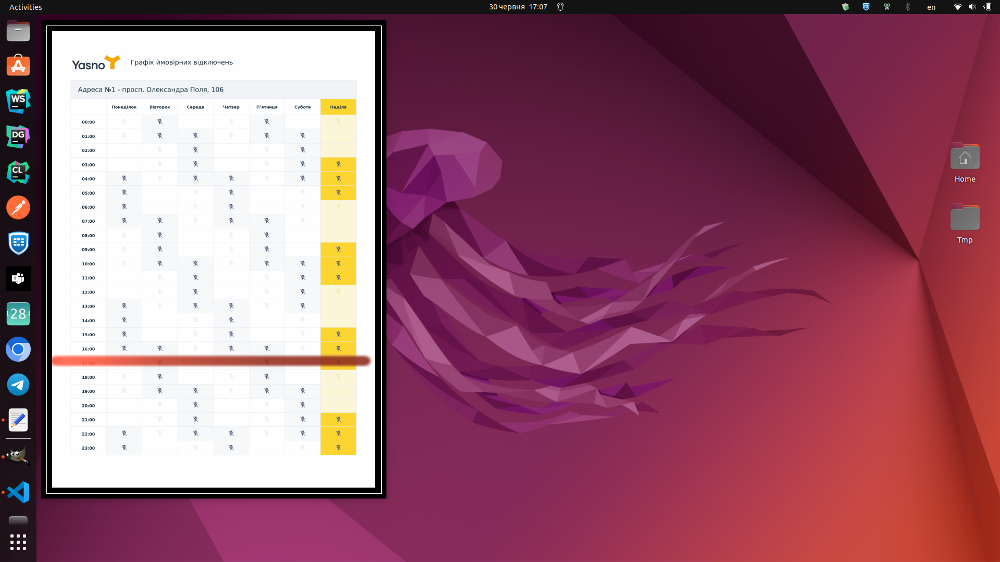

# conky-yasno
This conky theme displays [YASNO](https://yasno.com.ua/) power outages.



## Dependencies
This script requires modules/libraries: 
* Conky module, which can be installed using: </br>
`sudo apt install conky-all`
* jq: </br>
`sudo apt install jq`

## Installation
1. Dowload the project and extract it to your `/home` folder.
2. Navigate to the folder and run the install script in the terminal
```
./install
```

## Add your address
1. Go to [Yasno power outages page](https://yasno.com.ua/schedule-turn-off-electricity) and choose your address;
2. Copy the link of the button that leads to downloading the pdf file;

3. Paste your link to `.private_url.txt` as indicated in `.private_url_example.txt`.

## Tests
This code/script has been tested on Ubuntu 22

